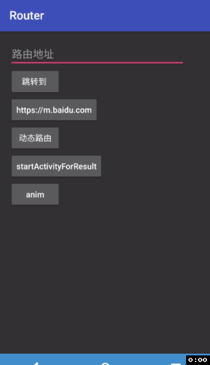

   

# Router

[中文wiki](https://github.com/chenenyu/Router/wiki). 方便的话给个star!❤️



## Getting started

*  Add router gradle plugin to your project-level `build.gradle`, as shown below.

```Groovy
buildscript {
    repositories {
        google()
        mavenCentral()
        // jcenter() // deprecated
    }
    dependencies {
        classpath 'com.android.tools.build:gradle:+'
        classpath "com.chenenyu.router:gradle-plugin:x.y.z"
    }
}
```
latest `router-gradle-plugin` version: 


* Apply router plugin in your module-level 'build.gradle'.

```Groovy
apply plugin: 'com.android.application' // apply plugin: 'com.android.library'
apply plugin: 'com.chenenyu.router'
```

**注意**: 在rootProject的`build.gradle`文件中, 可以指定插件引用的library版本.

```groovy
ext {
    routerVersion = 'x.y.z'
    compilerVersion = 'x.y.z'
    compilerLoggable = true/false // 打开/关闭编译期log
}
```
latest `router` version: 

latest `compiler` version: 


## 基本用法

* 添加拦截器(可选)

```java
@Interceptor("SampleInterceptor")
public class SampleInterceptor implements RouteInterceptor {
    @Override
    public RouteResponse intercept(Chain chain) {
        // do something
        return chain.process();
    }
}
```

* 添加注解

```java
// 给Activity添加注解，指定了路径和拦截器(可选)
@Route(value = "test", interceptors = "SampleInterceptor")
public class TestActivity extends AppCompatActivity {
    @InjectParam(key="foo") // 参数映射
    String foo;
  
     @Override
    protected void onCreate(Bundle savedInstanceState) {
        super.onCreate(savedInstanceState);
        Router.injectParams(this);  // 自动从bundle中获取并注入参数
        ...
    }
}

// 给Fragment添加注解
@Route("test")
public class TestFragment extends Fragment {
    ...
}
```

* 跳转

```java
// 简单跳转
Router.build("test").go(this);
// startActivityForResult
Router.build("test").requestCode(0).go(this);
// 携带bundle参数
Router.build("test").with("key", Object).go(this);
// 添加回调
Router.build("test").go(this, new RouteCallback() {
    @Override
    public void callback(RouteStatus status, Uri uri, String message) {
        // do something
    }
});

// 获取路由对应的intent
Router.build("test").getIntent();
// 获取注解的Fragment
Router.build("test").getFragment();
```

## 进阶用法

建议浏览 [wiki](https://github.com/chenenyu/Router/wiki).

## 讨论

QQ group: 271849001

## Donate ❤️

[Click here](https://github.com/chenenyu/Router/wiki/Donate).

## License

[Apache 2.0](https://github.com/chenenyu/Router/blob/master/LICENSE)